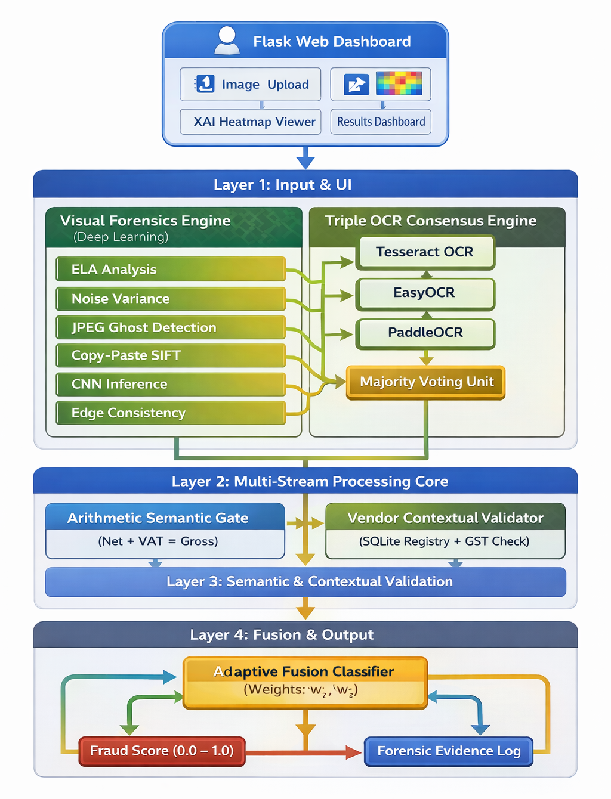
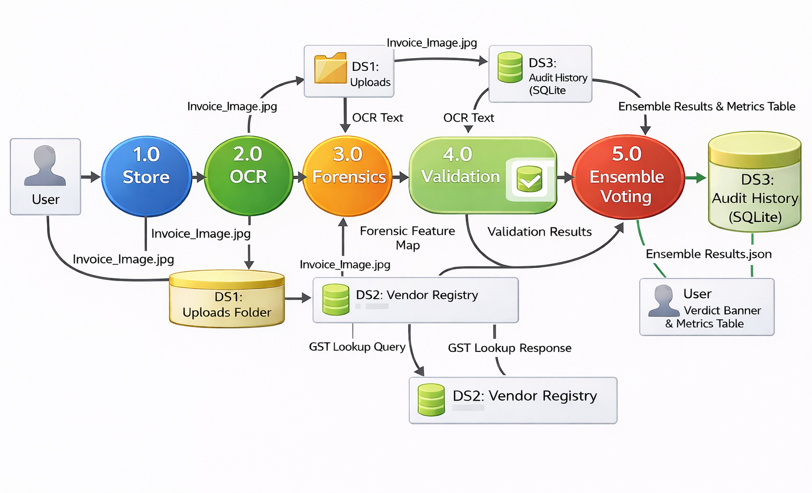
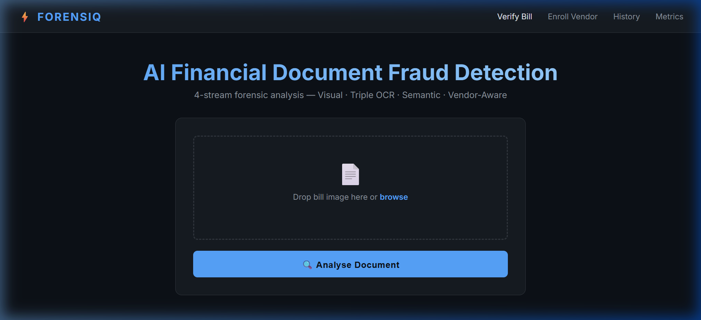
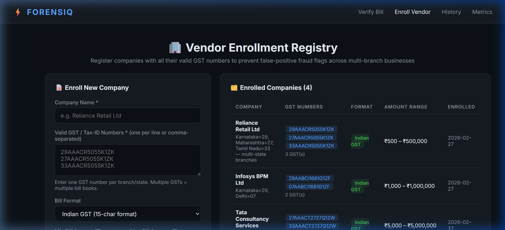
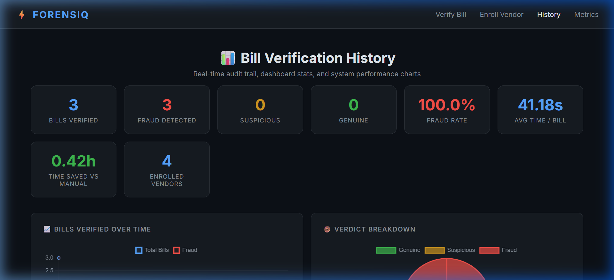
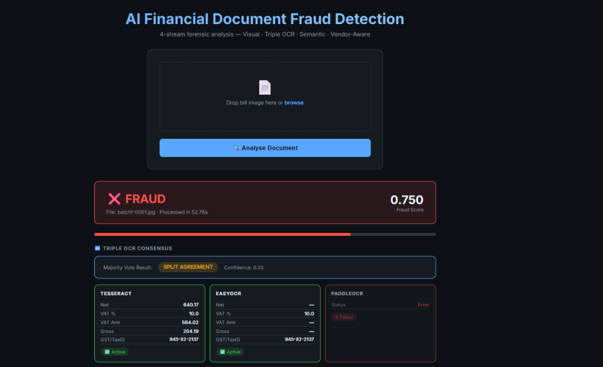

# FORENSIQ: AI-Powered Document Fraud Detection

FORENSIQ is a comprehensive, multi-modal fraud detection system designed to authenticate financial documents and bills. It utilizes a robust 4-stream pipeline that combines visual forensics, optical character recognition (OCR), semantic validation, and a context-aware vendor registry to detect tampering, forgery, and anomalies in uploaded documents.

## Key Features

- **Visual Forensics**: Analyzes images for tampering artifacts using advanced vision models and techniques like Error Level Analysis (ELA).
- **Triple OCR Consensus**: Extracts text robustly using a multi-engine OCR approach to ensure high accuracy.
- **Semantic Gate Validation**: Cross-references extracted data against expected formats and logical rules.
- **Vendor Enrollment & Context**: Validates bills against an internal registry of enrolled vendors, checking for format consistency, historical patterns, and expected GST details.
- **Audit & History Dashboard**: Tracks all verification attempts, maintaining a secure log with verdicts, granular fraud scores, and processing times.

## System Architecture



*The 4-stream pipeline of FORENSIQ integrating Vision, OCR, Semantic Validation, and Vendor Context.*

## Data Flow Diagram



## User Interface

The web application provides an intuitive interface for both document verification and system administration.

### Bill Verification
Easily upload documents for instant, multi-modal fraud analysis.


### Vendor Enrollment
Register known vendors with their GST numbers, expected transaction amounts, and bill formats to enhance context-aware detection.


### Audit History
Monitor past verifications, view verdicts, and access detailed fraud scores across all processed documents.


### Validation Dashboard
Review comprehensive system usage and validation data.


## Installation & Setup

1. **Clone the repository:**
   ```bash
   git clone <your-repo-url>
   cd fraud_document_ai
   ```

2. **Install dependencies:**
   Ensure you have Python 3.8+ installed. *(Assuming a `requirements.txt` is present)*:
   ```bash
   pip install -r requirements.txt
   ```

3. **Run the Application:**
   Start the Flask server:
   ```bash
   python app.py
   ```

4. **Access the Web UI:**
   Open your browser and navigate to `http://127.0.0.1:5000`

## Project Structure

- `app.py`: Main Flask application handling routes and pipeline integration.
- `classifier/`: Logic for the adaptive fusion model and fraud classification.
- `ocr/`: OCR engine implementation for robust text extraction.
- `vision/`: Visual forensics modeling and image processing.
- `utils/`: Helpers for database operations (`vendor_registry.db`), preprocessing, and logging.
- `templates/`: HTML templates for the web interface.
- `Images/`: Architecture diagrams and UI screenshots.
